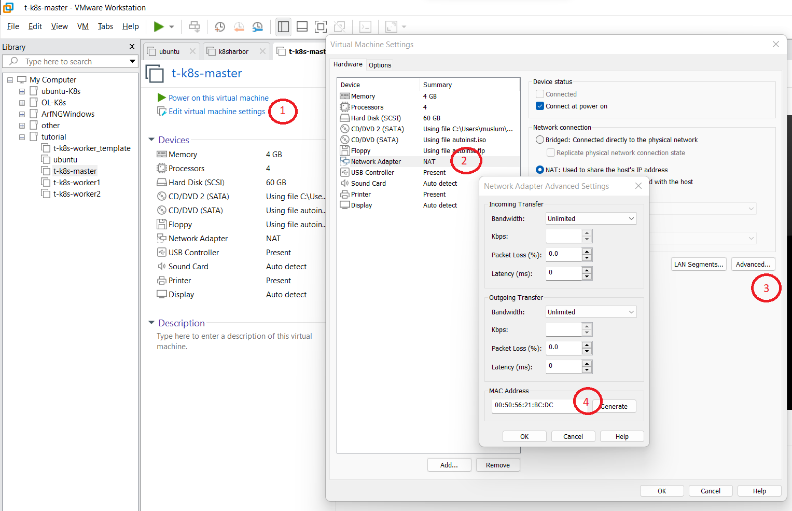
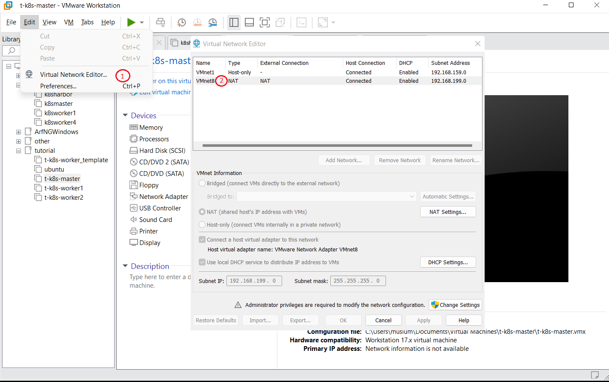

# Ubuntu 22.04
**Ubuntu 22.04** makinesinin kurulumu ve ortamların hazırlanması adımlarını içerir.

---

**1:** Vmware Work Station Ayarları

- min 4 GB RAM e sahip makine oluşturulur.
- min 2 CPUs olacak şekilde ayarlanır.
- Network Driver olarak NAT seçilir

---

**2:** Ubuntu Desktop 22.04 Kurulumu tamamlanır.

---

**3:** Vmware Work Station ile StaticIP ayarları

- Bu işlem yapılır ubuntu kapalı olmalıdır.
- sanal makinenin mac adresi `Edit virtual machine settings\Network Adapter\Advanced` bölümünden öğrenilir. Örneğin:(00:0C:29:F0:7C:73)
  
  

- Network driver ismi `Edit\Virtual Network Editör` ekranından öğrenilir. Örneğin:(VMnet8)
 
  

- `C:\ProgramData\VMware\vmnetdhcp.conf` dosya içine aşağıdaki kodlar eklenir.

    ```
    #Ubuntu x86
    host VMnet8 {
        hardware ethernet 00:0C:29:F0:7C:73;
        fixed-address 2.2.2.7;
    }
    ```

- `services.msc` den `VMware DHCP Service` servisi yeniden başlatılır. 

- İşletim sistemi başlatılır ve Web Tarayıcıdan herhangi siteye girilerek internete erişim sorunu var mı kontrol edilir.

---

**4:** Ubuntu Desktop 22.04 Kurulum sonrası adımlar.

*paket repoları ve paketler güncellenir*

```
$ sudo apt install update
$ sudo apt install ugrade
``` 

*sık kullanılan uygulamalar kurulur*
```
$ sudo apt install curl -y
$ sudo apt install net-tools -y
$ sudo apt install nautilus-admin -y
$ sudo nautilus -q
---


