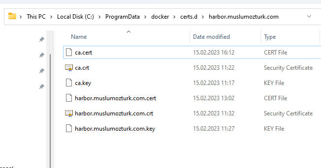

# Harbor
**Harbor'ın** Ubuntu 22.04 ortamında kurulumu adımlarına buradan ulaşabilirsiniz.

---

**0:** minimum gereksinimler

| Resource | Minimum | Recommended |
| -------- | ------- | ----------- |
| CPU      |   2 CPU |	  4 CPU    |
| Mem      |   4 GB  |	  8 GB     |
| Disk     |  40 GB  |  160 GB     |

---

**1:** host dosyasına domain'in tanımlanması

```shell
$ echo '192.168.199.54  harbor.muslumozturk.com' | sudo tee -a /etc/hosts
```
---

**2:** sertifika üretimi

```shell
$ mkdir harbor-files && cd harbor-files

$ sudo apt install openssl

$ openssl genrsa -out ca.key 4096

$ openssl req -x509 -new -nodes -sha512 -days 3650 -subj "/C=CN/ST=Istanbul/L=Istanbul/O=devops/OU=Personal/CN=harbor.muslumozturk.com" -key ca.key -out ca.crt

$ openssl genrsa -out harbor.muslumozturk.com.key 4096

$ openssl req -sha512 -new -subj "/C=CN/ST=Istanbul/L=Istanbul/O=devops/OU=Personal/CN=harbor.muslumozturk.com" -key harbor.muslumozturk.com.key -out harbor.muslumozturk.com.csr

$ cat > v3.ext << EOF
authorityKeyIdentifier=keyid,issuer
basicConstraints=CA:FALSE
keyUsage = digitalSignature, nonRepudiation, keyEncipherment, dataEncipherment
extendedKeyUsage = serverAuth
subjectAltName = @alt_names

[alt_names]
DNS.1=harbor.muslumozturk.com
DNS.2=harbor.muslumozturk
DNS.3=hostname
EOF

$ openssl x509 -req -sha512 -days 3650 -extfile v3.ext -CA ca.crt -CAkey ca.key -CAcreateserial -in harbor.muslumozturk.com.csr -out harbor.muslumozturk.com.crt

$ openssl x509 -inform PEM -in harbor.muslumozturk.com.crt -out harbor.muslumozturk.com.cert

$ openssl x509 -inform PEM -in ca.crt -out ca.cert
```

---

**3:** ubuntuda kök sertifikaların tanılması

*Bu işlemler hem master hemde worker node'larda yapılacaktır*

```shell
$ sudo apt-get install -y ca-certificates

$ sudo cp ca.crt /usr/local/share/ca-certificates

$ sudo update-ca-certificates
```

---

**4:** docker kurulumu

```shell
$ sudo apt update

$ sudo apt upgrade

$ sudo apt install curl lsb-release ca-certificates apt-transport-https software-properties-common -y

$ curl -fsSL https://download.docker.com/linux/ubuntu/gpg | sudo gpg --dearmor -o /usr/share/keyrings/docker-archive-keyring.gpg

$ echo "deb [arch=$(dpkg --print-architecture) signed-by=/usr/share/keyrings/docker-archive-keyring.gpg] https://download.docker.com/linux/ubuntu $(lsb_release -cs) stable" | sudo tee /etc/apt/sources.list.d/docker.list > /dev/null

$ sudo apt update

$ apt-cache policy docker-ce

$ sudo apt install docker-ce -y

$ sudo systemctl enable docker && sudo systemctl start docker

```

*check docker is working*

```shell
$ docker --version
```
---

**5:** docker-compose kurulumu

```shell
$ sudo usermod -aG docker ${USER}

$ sudo curl -SL https://github.com/docker/compose/releases/download/v2.16.0/docker-compose-linux-x86_64 -o /usr/local/bin/docker-compose

$ sudo chmod +x /usr/local/bin/docker-compose

```

*check docker-compose is working*

```shell
$ docker-compose --version
```
---

**6:** harbor kurulumu

```shell
$ sudo mkdir /etc/harbor

$ sudo cp harbor.muslumozturk.com.crt /etc/harbor/

$ sudo cp harbor.muslumozturk.com.key /etc/harbor/
```

```shell
$ wget https://github.com/goharbor/harbor/releases/download/v2.7.1/harbor-online-installer-v2.7.1.tgz

$ tar xzvf harbor-online-installer-v2.7.1.tgz
```

*harbor/harbor.yml dosyasının düzenlenmesi*
```
$ cd harbor

$ sudo nano harbor.yml
```

```yaml
hostname: harbor.muslumozturk.com
https:
    certificate: /etc/harbor/harbor.muslumozturk.com.crt
    private_key: /etc/harbor/harbor.muslumozturk.com.key

harbor_admin_password: Harbor12345
```


```shell
$ sudo ./prepare

$ sudo ./install.sh --with-notary --with-trivy

```

*harbor restart sorunu çözümü*

```shell
$ sudo cp docker-compose.yml /etc/harbor/

$ sudo -s

$ sudo cat > /etc/systemd/system/harbor.service << EOF
[Unit]
Description=Harbor
After=docker.service systemd-networkd.service systemd-resolved.service
Requires=docker.service
Documentation=http://github.com/vmware/harbor

[Service]
Type=simple
Restart=on-failure
RestartSec=5
ExecStart=/usr/local/bin/docker-compose -f /etc/harbor/docker-compose.yml up
ExecStop=/usr/local/bin/docker-compose -f /etc/harbor/docker-compose.yml down

[Install]
WantedBy=multi-user.target
EOF

$ exit

$ systemctl enable harbor

$ systemctl start harbor 

```

*kontrol etmek için internet tarayıcıdan harbor arayüzüne girilir*
[https://harbor.muslumozturk.com](https://harbor.muslumozturk.com)

```
Kullanıcı Adı: admin
Parola: Harbor12345 (harbor.yml içinde tanımlı olan paroladır.)
```
---

**7:** kullanıcı tanımlama

`"Administration\User"` menüsünden kullanıcı ların tanımlandığı sayfa açılır. `"NEW USER"` butonuna tıklayarak yeni bir kullanıcı eklenir. Bu dökümantasyondaki örnek senaryo için `"pushuser"` adında bir kullanıcı ile devam edilecektir.

Kullanıcı eklendikten sonra `"SET AS ADMIN"` butonuna tıklayarak kullanıcıya yetki verilme işlemi tamamlanmış olur.

---

**8:** private repository oluşturma

`"Project"` menüsünden repositorylerin olduğu sayfa açılır. `"NEW PROJECT"` butonuna tıklayarak yeni repository tanımlama işlemini yapıyoruz. Private repository oluşturmak istediğimiz için `"public"` özelliğinin seçili <ins>**olmamasına**</ins> dikkat ediyoruz.  

---

**9:** docker desktop üzerinden harbor'a imaj gönderme

*docker desktop ile harbor a bağlanmak için harbor' a ait ssl sertifikalar aşağıdaki dosyaların içine konulmalı ve  **Docker Desktop** uygulaması restart edilmelidir*

```
C:\Users\muslum\.docker\certs.d\harbor.muslumozturk.com

C:\ProgramData\docker\certs.d\harbor.muslumozturk.com
```



*docker'la harbora oluşturmuş olduğumuz  `pushuser` kullanıcısı ile login oluyoruz.*
```shell
$ docker login harbor.muslumozturk.com

#Note:logout olmak istersek aşağıdaki komut kullanılır
$ docker logout harbor.muslumozturk.com 
```


*proje içerisinden imaj oluşturulur*
```shell
$ docker build -t my-test-image:v1 .
```

*imajımızın tag ini oluşturuyoruz ve harbor'a push yapıyoruz*
```shell
$ docker tag my-test-image:v1 harbor.muslumozturk.com/my-repository/my-test-image:v1

$ docker push harbor.muslumozturk.com/my-repository/my-test-image:v1
```
---

## Kaynaklar

[https://goharbor.io/docs/1.10/install-config/installation-prereqs/](https://goharbor.io/docs/1.10/install-config/installation-prereqs/)

[https://www.youtube.com/watch?v=Zx4KTsxs0XE](https://www.youtube.com/watch?v=Zx4KTsxs0XE)

[https://github.com/alperen-selcuk/private-registry-harbor-installation](https://github.com/alperen-selcuk/private-registry-harbor-installation)

